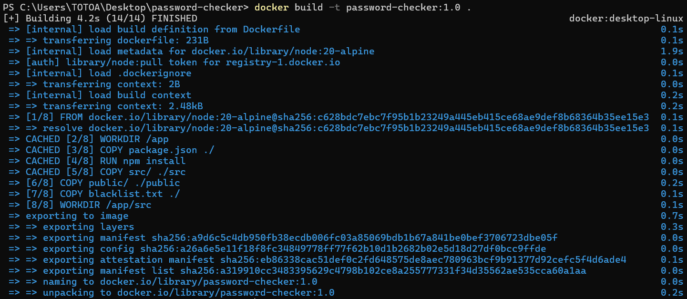
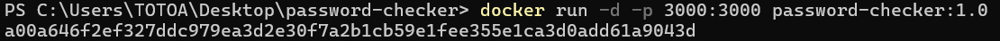
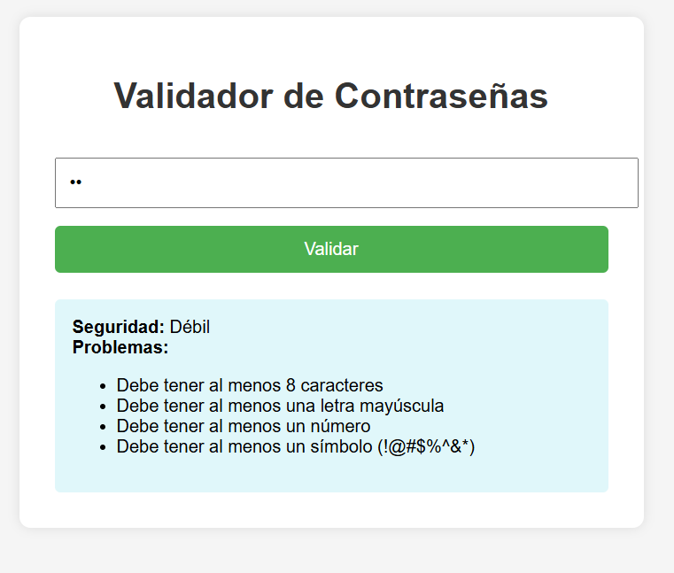
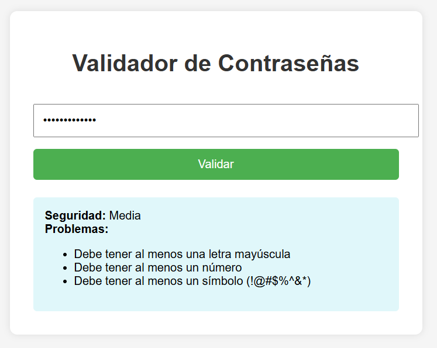
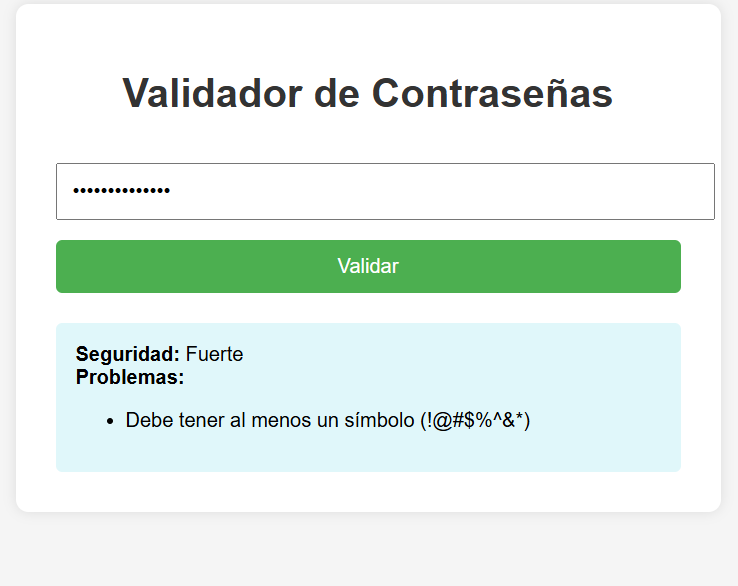
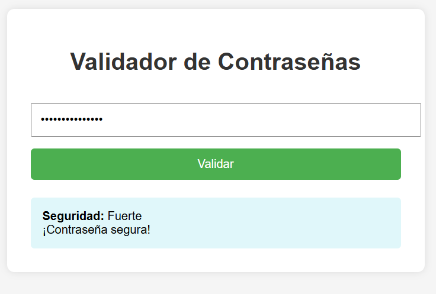

# Password-Checker-con-Docker
Este es un microservicio para validar la seguridad de contraseñas usando Node.js, Express y Docker. Evalúa la fortaleza de una contraseña con base en criterios comunes y una lista negra de contraseñas comunes.

### Características 
1. Interfaz HTML simple y clara.
2. Validación con reglas como longitud, uso de mayúsculas, minúsculas, números y símbolos.
3. Lista negra de contraseñas comunes.
4. Puntaje de seguridad (Débil, Media, Fuerte).
5. Respuestas detalladas de errores.

### Requisitos
1. Docker

### Instalación
1. Clona el repositorio:
   git clone https://github.com/AlonsoCanales-Prog/Password-Checker-con-Docker.git

2. Construye la imagen en Docker:
   docker build -t password-checker:1.0 .
   


4. Ejecuta el contenedor:
   docker run -d -p 3000:3000 password-checker:1.0
   

6. Abre tu navegador en:
   http://localhost:3000

Estructura del proyecto:
```
password-checker/
│
├── Dockerfile
├── package.json
├── blacklist.txt
├── src/
│   └── server.js
└── public/
    └── index.html
```

### Notas
Si modificas server.js, blacklist.txt o index.html, necesitas reconstruir la imagen con docker build y reiniciar el contenedor.
Puedes añadir más contraseñas comunes en blacklist.txt.

### Prueba 1
Contraseña: hi


### Prueba 2
Contraseña: hicomoestas


### Prueba 3
Contraseña: Hicomoestas


### Prueba 4
Contraseña: Hicomoestas@


### Licencia
MIT


